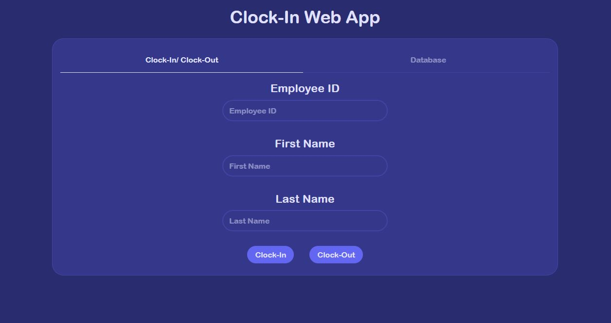
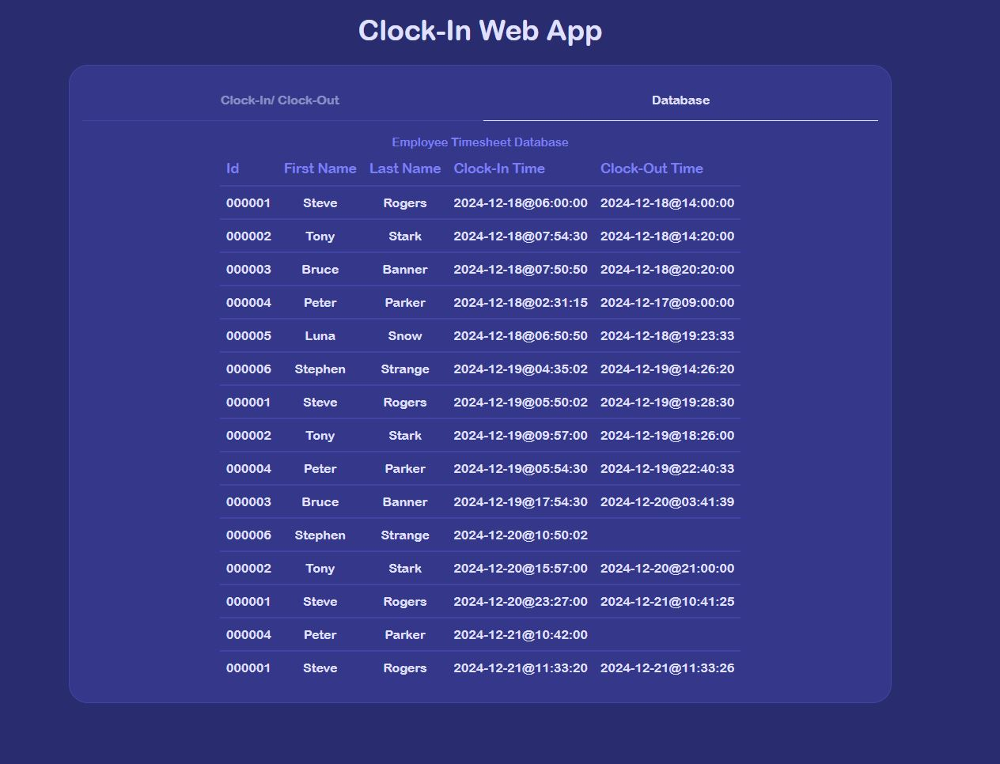

# Clock-In App
## Clock-In Application URL: https://clock-in-app-ten.vercel.app/
---
## How to run the Clock-In App locally
### Prerequisites
- Node version 18 or 20 installed
- Python 3 installed

### Steps
1. First clone the repository from GitHub. URL: [Clock-In App](https://github.com/AlexanderChao14/Clock-In-App)
2. Open your terminal and run `cd frontend/clock-in-app` to cd into the frontend folder.
3. Run the command `npm i` or `npm install` to install the required frontend packages. 
4. Create a `.env` file in this directory and add this line of code `VITE_API_BASE_URL=http://127.0.0.1:8000/` and save this file.
5. Make sure you are in `frontend/clock-in-app/` and then run the command `npm run dev` to run the frontend locally. Open a web browser and type in `http://localhost:5173/` to access the frontend app that is running locally. 
6. Open a new terminal while the previous one is still running. In the new terminal run `cd backend/`. Now we are going to download and create a virtual environment for Python to run the backend of the Clock-In App locally. Run the command `python -m venv ./env`.
7. Once the virtual environment is created in this folder, if you are using a Git Bash terminal run the command: `source env/Scripts/activate`. If you are using a Powershell terminal run the command: `./env/Script/activate`. The virtual environment should be running now in this terminal and you will know if this is working when `(env)` now appears before or above your terminal input.
8. Run `cd /clock_in_app` to go into this folder, we will now run `pip install -r requirements.txt` to install all the required python libraries.
9. Run `python manage.py makemigrations` to generate a migration file and folder if you are missing it. Now run `python manage.py migrate` to generate the SQLite database if not already initiallized within the clone repository.
10. Now run `python manage.py runserver` to start up the backend locally.
11. Open a new web browser from your local frontend web page and enter in either `http://127.0.0.1:8000/` or `localhost:8000` to see the backend that is running locally. You should see a blank database if you have created a new SQLite database or some dummy data entry from the cloned repository SQLite database.
12. Now go back to your frontend application and refresh the web page. You should see something like this running now.  
13. Now you can use the Clock-In App locally and employees can now clock in and out of the web application.

---
## The Tech Stack And Tools Used For The Project
### Frontend
- Sveltekit 
- Tailwind css
- Skeletonlabs
- Prettier
- Eslint
- Vercel

### Backend
- Django
- Django REST Framework
- Django Cors Header
- SQLite
- Gunicorn
- Render

---
### List Of Assumptions
- The max number of characters for a valid first and last name is 128 characters long.
- The smallest first and last name can be 1 charcter long.
- You are allowed to have spaces within your first and last name.
- We will assume that capitalization and lowercase can be ignore when comparing the entered first and last name with the existing first and last name from the database. We will auto lowercase the string to compare the two strings. 
- The system will give an error when the digits for the entered employee id is not exactly 6 digits long. Also the user cannot enter in more than 6 digits as well.
- User with employee id like `1` will need to add the leading `0` in their employee id when their employee id to clock in or out.   
- We will assume only alphabet letters and spaces are only allowed in the first and last name entry field.
- We will assume only numbers can be entered in the id entry field for clocking in or out.
- We will assume that all employee id, first name, and last name needs to be filled out in order to clock in or out. Otherwise the system will alert the user about the error and will not clock in or out the user.
- We will assume that a person clocked in is defined by a timestamp data entry with a `null` or blank `clockOut` data field.
- You cannot clock in again if you already clocked in.
- You cannot clock out if you have no clocked in entry.
- For clocking out function, we are looking for a valid clocked In data entry by matching the employee id with a null clock out time field.
- When clocking out, if we cannot find a valid clocked In data entry that matches the employee id, then we will assume that null means the employee has not clocked in yet.
- The clock out function will also compare the entered first and last name with the valid clocked in first and last name to see if it matches. When comparing we will compare both sides in all lowercase.

